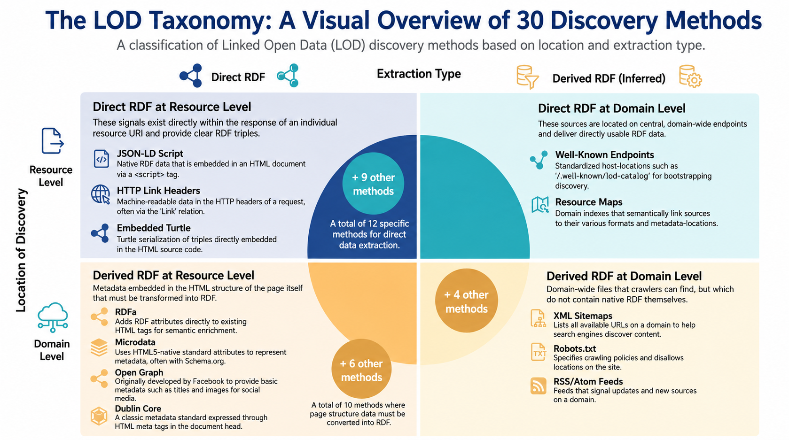
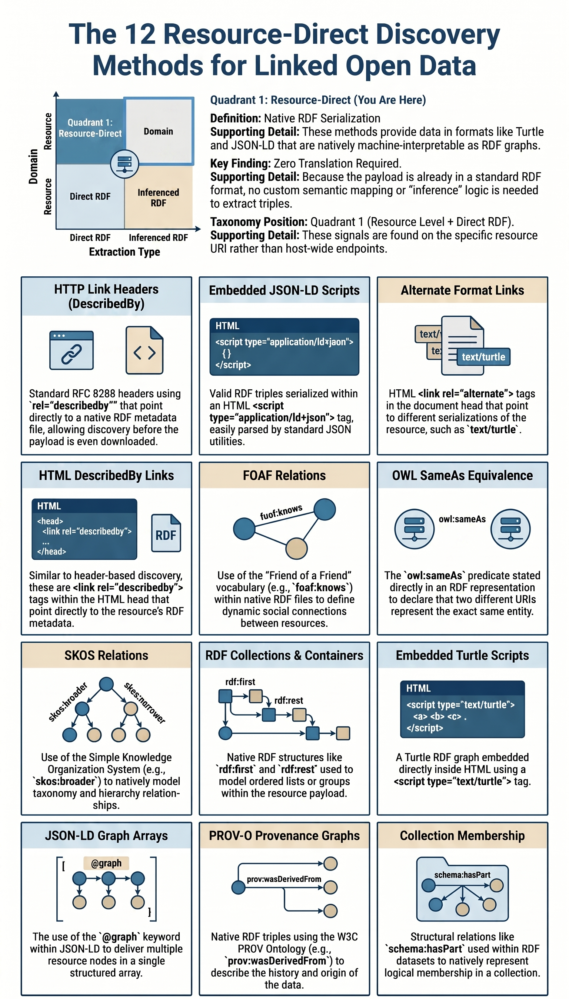
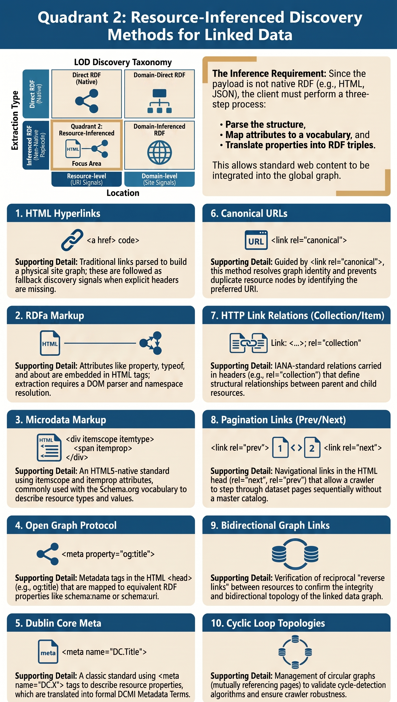
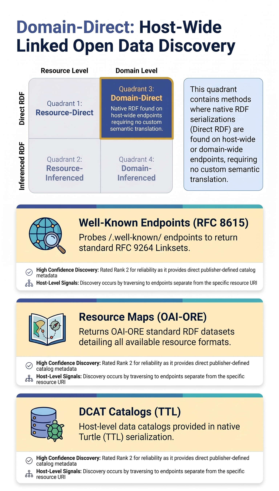
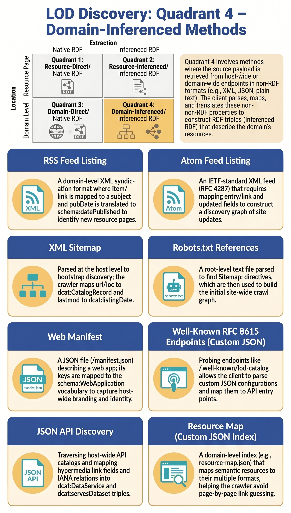

# Taxonomy and Analysis of Web Resource Discovery Methods in the LOD Discovery Framework

This document divides the web resource discovery methods used in the Linked Open Data (LOD) discovery framework into a 2x2 taxonomy and provides a detailed guide on how this taxonomy can be implemented to optimize resource discovery cascades.

---

## 1. The 2x2 Classification Taxonomy

The discovery methods are categorized along two primary dimensions:

### Dimension 1: Location of Discovery (Relative to target Resource URI)
*   **Resource Level**: The discovery signals are found directly on or within the response from the initial resource URI itself (the "You Are Here" marker).
*   **Domain Level**: The discovery signals are found by traversing to host-wide, domain-wide, or catalog-wide endpoints that are separate from the initial resource URI.

### Dimension 2: Extraction Type (Interpretation Mechanism)
*   **Direct RDF**: The payload retrieved is natively serialized in an RDF format (e.g., Turtle, JSON-LD, RDF/XML) requiring no semantic property mapping or custom translation logic.
*   **Inferenced RDF**: The payload retrieved is a non-RDF format (e.g., HTML, XML, Web Manifest, plain JSON) that contains metadata or link structures. The client must parse, map, and translate these properties to construct RDF triples.

### The Four Quadrants
Combining these two dimensions yields four distinct discovery categories:

```
                  +--------------------------------+--------------------------------+
                  |           DIRECT RDF           |         INFERENCED RDF         |
+-----------------+--------------------------------+--------------------------------+
|                 |  Quadrant 1: Resource-Direct   | Quadrant 2: Resource-Inferenced|
|  RESOURCE LEVEL |  (Direct payload on resource)  |  (Inferred from resource HTML) |
|                 |  Example: Content Negotiation  |  Example: Microdata, RDFa      |
+-----------------+--------------------------------+--------------------------------+
|                 |   Quadrant 3: Domain-Direct    |  Quadrant 4: Domain-Inferenced |
|   DOMAIN LEVEL  |  (Direct RDF at host-level)    |  (Inferred from host-wide XML) |
|                 |  Example: DCAT catalog in TTL  |  Example: robots.txt, sitemaps |
+-----------------+--------------------------------+--------------------------------+
```

### LOD Discovery Overview Diagram


### Quadrant Diagrams

For a detailed breakdown of discovery methods in each quadrant, refer to the diagrams below:

#### Quadrant 1: Resource-Level Direct RDF


#### Quadrant 2: Resource-Level Inferenced RDF


#### Quadrant 3: Domain-Level Direct RDF


#### Quadrant 4: Domain-Level Inferenced RDF


---

## 2. Analysis of the 30 Discovery Methods

Below is a detailed analysis of all 30 discovery strategies. For each method, we present the four possibilities, specifications, extra usage context, recommended categorization, and, where applicable, the proposed RDF retrieval design.

---

### 1. HTML_LINKS (HTML Hyperlinks)
*   **Specification**: [HTML5 Hyperlink Specification](https://html.spec.whatwg.org/multipage/links.html) (W3C / WHATWG)
*   **Extra Context**: Traditional hyperlinks are parsed by crawlers to build a physical site graph. In LOD discovery, they are followed as fallback links when explicit discovery headers are missing, allowing standard web discovery.
*   **Four Possibilities**:
    *   *Resource-Direct*: N/A (generic HTML hyperlinks do not contain native RDF serialization).
    *   *Resource-Inferenced* (Recommended): The links reside on the resource page body, and the client must infer the resource relations (e.g. `next`, `about`) and map the HTML elements into graph edges.
    *   *Domain-Direct*: N/A.
    *   *Domain-Inferenced*: Crawling links across the entire domain to construct site topology.
*   **Recommendation**: **Resource-Inferenced**
*   **Rationale**: Hyperlinks are embedded in the resource HTML document. Extracting them requires parsing the HTML structure, and translating them into RDF triples is an inference process.
*   **Proposed RDF Retrieval Design**:
    ```
    1. Parse DOM: Identify <a href="URL"> tags in the page body.
    2. Filter: Skip mailto:, tel:, and local hash anchors.
    3. Map: Relate the current page URI to the target URL.

    Triples:
    <> schema:relatedLink <URL> ;
       rdfs:seeAlso <URL> .
    ```

---

### 2. LINK_HEADERS (HTTP Link Headers - DescribedBy)
*   **Specification**: [RFC 8288 (Web Linking)](https://datatracker.ietf.org/doc/html/rfc8288) (IETF)
*   **Extra Context**: Served directly in HTTP headers, avoiding payload parsing. Highly recommended for machine discovery because clients can verify metadata availability before downloading HTML bodies.
*   **Four Possibilities**:
    *   *Resource-Direct* (Recommended): The Link headers are retrieved directly from the resource URI and point to a native RDF metadata file (e.g. Turtle).
    *   *Resource-Inferenced*: The Link headers point to a non-RDF resource that requires extraction.
    *   *Domain-Direct*: Link headers served on domain-level endpoints.
    *   *Domain-Inferenced*: Link headers pointing to non-RDF resources at the domain level.
*   **Recommendation**: **Resource-Direct**
*   **Rationale**: HTTP Link headers are served directly from the resource URL. When configured with `rel="describedby"` and pointing to an RDF media type, they lead directly to a native RDF serialization of that resource's metadata without any HTML parsing.

---

### 3. JSON_LD_SCRIPT (Embedded JSON-LD Script)
*   **Specification**: [JSON-LD 1.1 Specification](https://www.w3.org/TR/json-ld11/) (W3C)
*   **Extra Context**: Valid RDF serialized inside an HTML script tag. Popularized by search engines like Google for structured data extraction. Easy to parse using native JSON utilities.
*   **Four Possibilities**:
    *   *Resource-Direct* (Recommended): The JSON-LD script is retrieved from the resource page and parsed directly as a valid RDF graph.
    *   *Resource-Inferenced*: The script requires mapping custom JSON properties because of missing or unresolved `@context` keys.
    *   *Domain-Direct*: Finding JSON-LD scripts on other domain pages.
    *   *Domain-Inferenced*: Translating embedded JSON-LD on separate domain pages.
*   **Recommendation**: **Resource-Direct**
*   **Rationale**: Since JSON-LD is a standard RDF serialization, it provides fully-formed RDF triples directly. Even though it is embedded in HTML and requires script tag extraction, it does not require property mapping or vocabulary mapping to yield a valid RDF graph.

---

### 4. RDFA (RDFa Markup)
*   **Specification**: [RDFa Core 1.1 Specification](https://www.w3.org/TR/rdfa-core/) (W3C)
*   **Extra Context**: Embeds RDF attributes directly inside existing HTML tags. Avoids double-templating, but parsing requires a full DOM parser and namespace resolution.
*   **Four Possibilities**:
    *   *Resource-Direct*: N/A (RDFa requires the HTML body container).
    *   *Resource-Inferenced* (Recommended): Attributes on the resource HTML elements are parsed and mapped to RDF triples.
    *   *Domain-Direct*: N/A.
    *   *Domain-Inferenced*: Parsing RDFa on other domain pages.
*   **Recommendation**: **Resource-Inferenced**
*   **Rationale**: RDFa attributes (`property`, `typeof`, `about`) are integrated into the resource's HTML body. Generating RDF from them requires walking the DOM tree and inferring semantic relationships from the nesting and page structure.
*   **Proposed RDF Retrieval Design**:
    ```
    1. Parse DOM: Traverse HTML tags looking for about, typeof, property, resource, and vocab attributes.
    2. Resolve Namespaces: Map prefixes (e.g. schema:) using prefix/vocab definitions.
    3. Map: Extract triples based on W3C RDFa Core 1.1 rules.

    Triples:
    <subject> <predicate> <object> .
    ```

---

### 5. MICRODATA (Microdata Markup)
*   **Specification**: [HTML Microdata](https://www.w3.org/TR/microdata/) (W3C)
*   **Extra Context**: HTML5-native metadata nesting standard. Mostly used with schema.org. In LOD discovery, Microdata statements are translated into RDF triples using standard vocabulary mapping.
*   **Four Possibilities**:
    *   *Resource-Direct*: N/A.
    *   *Resource-Inferenced* (Recommended): HTML microdata attributes are parsed and translated into RDF triples using vocabularies like schema.org.
    *   *Domain-Direct*: N/A.
    *   *Domain-Inferenced*: Parsing Microdata across domain pages.
*   **Recommendation**: **Resource-Inferenced**
*   **Rationale**: Microdata utilizes HTML5 attributes (`itemscope`, `itemtype`, `itemprop`). It requires parsing the HTML DOM and running translation algorithms to construct RDF triples, making it inherently inferenced and resource-level.
*   **Proposed RDF Retrieval Design**:
    ```
    1. Parse DOM: Traverse HTML tags looking for itemscope, itemtype, itemprop, and itemid attributes.
    2. Map Types: Map itemtype to rdf:type. Map itemid to subject URI.
    3. Map Properties: Map itemprop keys to predicates using the itemtype vocabulary prefix.

    Triples:
    <itemid> a <itemtype> ;
             <itemprop> <value> .
    ```

---

### 6. OPEN_GRAPH (Open Graph Protocol)
*   **Specification**: [Open Graph Protocol Specification](https://ogp.me/) (Facebook / Meta)
*   **Extra Context**: Originally created by Facebook to facilitate preview generation. Provides basic metadata (title, type, url, image) which the testbed maps to schema.org equivalents.
*   **Four Possibilities**:
    *   *Resource-Direct*: N/A.
    *   *Resource-Inferenced* (Recommended): The client parses `<meta>` tags in the HTML header of the resource URL and maps them to schema properties (e.g. `og:title` to `schema:name`).
    *   *Domain-Direct*: N/A.
    *   *Domain-Inferenced*: Parsing Open Graph tags on other domain pages.
*   **Recommendation**: **Resource-Inferenced**
*   **Rationale**: Open Graph metadata is served in the HTML head of the resource URL as key-value property tags. The client must map these keys to equivalent RDF properties (e.g. mapping `og:url` to `schema:url`).
*   **Proposed RDF Retrieval Design**:
    ```
    1. Parse DOM: Extract <meta property="og:key" content="value"> elements from HTML head.
    2. Map Keys: Translate og:title -> schema:name, og:description -> schema:description, og:image -> schema:image, og:url -> schema:url, og:type -> rdf:type.

    Triples:
    <canonicalUrl> a schema:WebPage ;
                   schema:name "value" ;
                   schema:description "value" .
    ```

---

### 7. DUBLIN_CORE (Dublin Core Meta)
*   **Specification**: [Dublin Core DCMI Metadata Terms](https://www.dublincore.org/specifications/dublin-core/dcmi-terms/) (ISO 15836)
*   **Extra Context**: A classic metadata standard for describing resources. Expressed via meta tags in HTML headers and mapped directly to Dublin Core metadata terms.
*   **Four Possibilities**:
    *   *Resource-Direct*: N/A.
    *   *Resource-Inferenced* (Recommended): The client parses Dublin Core `<meta>` tags in the resource's HTML head and translates them to DC terms triples.
    *   *Domain-Direct*: N/A.
    *   *Domain-Inferenced*: Parsing DC meta tags on other domain pages.
*   **Recommendation**: **Resource-Inferenced**
*   **Rationale**: Similar to Open Graph, Dublin Core metadata is represented via `<meta name="DC.X">` tags. It requires extracting elements from HTML and mapping them to formal Dublin Core metadata vocabularies.
*   **Proposed RDF Retrieval Design**:
    ```
    1. Parse DOM: Extract <meta name="DC.key" content="value"> elements from HTML head.
    2. Map Keys: Map directly to Dublin Core metadata namespace terms (http://purl.org/dc/terms/key).

    Triples:
    <currentUri> dcterms:title "value" ;
                 dcterms:creator "value" ;
                 dcterms:identifier "value" .
    ```

---

### 8. CANONICAL (Canonical URLs)
*   **Specification**: [RFC 6596 (Canonical Link Relation)](https://datatracker.ietf.org/doc/html/rfc6596) (IETF)
*   **Extra Context**: Guides search engines to the preferred URL for a resource. Used in LOD node normalization to resolve graph identity and avoid duplicate resource nodes.
*   **Four Possibilities**:
    *   *Resource-Direct*: N/A.
    *   *Resource-Inferenced* (Recommended): The canonical link tag on the resource page specifies page identity, from which the crawler infers the canonical resource URI.
    *   *Domain-Direct*: N/A.
    *   *Domain-Inferenced*: Finding canonical tags on separate domain pages.
*   **Recommendation**: **Resource-Inferenced**
*   **Rationale**: The `rel="canonical"` link is a metadata signal in the HTML head of the resource. It specifies URI equivalence which the client must process to align node identities in the RDF graph.
*   **Proposed RDF Retrieval Design**:
    ```
    1. Parse DOM: Extract <link rel="canonical" href="URL"> from HTML head.
    2. Map Identity: Map the current resource URL to the canonical URL as equivalent.

    Triples:
    <currentUri> owl:sameAs <canonicalUrl> ;
                 schema:url <canonicalUrl> .
    ```

---

### 9. ALTERNATE (Alternate Format Links)
*   **Specification**: [HTML5 Alternate Link Relations](https://html.spec.whatwg.org/multipage/links.html#link-type-alternate) (W3C / RFC 5988)
*   **Extra Context**: Points to alternate representations of the current resource. Commonly used in LOD discovery to locate alternate formats like Turtle, JSON-LD, or RDF/XML.
*   **Four Possibilities**:
    *   *Resource-Direct* (Recommended): The link tag in the HTML head points directly to alternate RDF representations of the resource (e.g., type `text/turtle`).
    *   *Resource-Inferenced*: The alternate link points to non-RDF formats that need translation.
    *   *Domain-Direct*: N/A.
    *   *Domain-Inferenced*: Alternate links on other domain pages.
*   **Recommendation**: **Resource-Direct**
*   **Rationale**: These are `<link rel="alternate">` tags defined in the resource's HTML head. When they reference RDF media types, they point directly to the native RDF serialization of that resource, bypassing the need for inference.

---

### 10. DESCRIBED_BY_LINK (HTML DescribedBy Link)
*   **Specification**: [RFC 8288 (Web Linking) - Section 3](https://datatracker.ietf.org/doc/html/rfc8288#section-3) (IETF)
*   **Extra Context**: A standard link relation indicating that the linked resource describes the current resource. Used in FAIR Signposting to connect landing pages directly to RDF metadata.
*   **Four Possibilities**:
    *   *Resource-Direct* (Recommended): The `<link rel="describedby">` tag in the HTML head points directly to the resource's RDF metadata.
    *   *Resource-Inferenced*: The link points to a non-RDF description page.
    *   *Domain-Direct*: N/A.
    *   *Domain-Inferenced*: Describedby links on other domain pages.
*   **Recommendation**: **Resource-Direct**
*   **Rationale**: Like `ALTERNATE`, this link is placed in the head of the resource HTML and points directly to the native RDF metadata of the resource.

---

### 11. FOAF (FOAF Relations)
*   **Specification**: [FOAF Vocabulary Specification](http://xmlns.com/foaf/spec/) (FOAF Project)
*   **Extra Context**: A native RDF vocabulary for describing people and social relationships. Resolves connections between individual resource graphs dynamically.
*   **Four Possibilities**:
    *   *Resource-Direct* (Recommended): FOAF triples are retrieved directly in native RDF files, defining links between resources (e.g. `foaf:knows`).
    *   *Resource-Inferenced*: FOAF properties are parsed from HTML markup.
    *   *Domain-Direct*: Finding FOAF graphs on separate domain endpoints.
    *   *Domain-Inferenced*: Inferring FOAF relationships by parsing other pages.
*   **Recommendation**: **Resource-Direct**
*   **Rationale**: FOAF properties are natively modeled within RDF representations. When loaded from a resource's RDF graph, they establish direct semantic connections to other resources.

---

### 12. SAME_AS (OWL SameAs equivalence)
*   **Specification**: [OWL 2 Web Ontology Language (Individual Equality)](https://www.w3.org/TR/owl2-syntax/#Individual_Equality.2FInequality) (W3C)
*   **Extra Context**: Declares that two URIs represent the exact same concept/entity. Crucial for web-scale Linked Data federation and identity reconciliation.
*   **Four Possibilities**:
    *   *Resource-Direct* (Recommended): The `owl:sameAs` predicate is directly stated in the RDF representation of the resource.
    *   *Resource-Inferenced*: Equivalent properties are mapped from HTML structures.
    *   *Domain-Direct*: SameAs mappings defined in domain-wide catalogs.
    *   *Domain-Inferenced*: Mapping equivalence based on string matches of domain-wide links.
*   **Recommendation**: **Resource-Direct**
*   **Rationale**: This represents native RDF semantics (`owl:sameAs`) loaded directly from the resource's RDF representation, declaring identity equivalence.

---

### 13. SKOS (SKOS Relations)
*   **Specification**: [SKOS Simple Knowledge Organization System Reference](https://www.w3.org/TR/skos-reference/) (W3C)
*   **Extra Context**: W3C standard for sharing taxonomy and hierarchy relationships (broader, narrower, related). Allows structured vocabulary discovery.
*   **Four Possibilities**:
    *   *Resource-Direct* (Recommended): SKOS triples (e.g. `skos:broader`) are loaded directly in the RDF resource payload.
    *   *Resource-Inferenced*: Parsing SKOS concepts from HTML page hierarchies.
    *   *Domain-Direct*: SKOS vocabularies hosted at domain-level concept schemes.
    *   *Domain-Inferenced*: Concept hierarchy mapped from domain sitemaps.
*   **Recommendation**: **Resource-Direct**
*   **Rationale**: SKOS is a native W3C RDF standard for knowledge systems. Stating concepts and relationships using SKOS within the resource representation is a direct RDF discovery mechanism.

---

### 14. RDF_COLLECTIONS (RDF Collections & Containers)
*   **Specification**: [RDF 1.1 Semantics](https://www.w3.org/TR/rdf11-mt/) (W3C)
*   **Extra Context**: Models ordered lists (first/rest) or container groups inside RDF. Useful for crawling page sequences in collections.
*   **Four Possibilities**:
    *   *Resource-Direct* (Recommended): Native RDF lists (`rdf:first`, `rdf:rest`) are parsed directly from the resource payload.
    *   *Resource-Inferenced*: Inferring list structures by parsing nested HTML lists (`<ul>`, `<ol>`).
    *   *Domain-Direct*: Collections hosted at separate domain URLs.
    *   *Domain-Inferenced*: Mapping domain sitemaps to RDF lists.
*   **Recommendation**: **Resource-Direct**
*   **Rationale**: Direct parsing of W3C RDF collection vocabularies from the resource's serialization.

---

### 15. RSS_FEED (RSS Feed Listing)
*   **Specification**: [RSS 2.0 Specification](https://www.rssboard.org/rss-specification) (RSS Advisory Board)
*   **Extra Context**: A standard syndication format. Parsed by crawlers at the domain level to identify newly updated resource pages and extract basic title/description properties.
*   **Four Possibilities**:
    *   *Resource-Direct*: N/A.
    *   *Resource-Inferenced*: N/A.
    *   *Domain-Direct*: N/A.
    *   *Domain-Inferenced* (Recommended): The client parses the domain-wide RSS feed (which is XML-based, not native RDF) to discover resource links and properties.
*   **Recommendation**: **Domain-Inferenced**
*   **Rationale**: RSS feeds are syndication files hosted at the domain level. Because RSS 2.0 is XML-based and lacks native RDF semantics, the client must parse the XML structure and infer page locations to generate triples.
*   **Proposed RDF Retrieval Design**:
    ```
    1. Parse XML: Retrieve the RSS feed payload and parse channel and item elements.
    2. Map Channel: Map channel/title -> schema:name. Map channel to schema:DataCatalog.
    3. Map Items: For each item, map item/link -> subject. Map title -> schema:name, pubDate -> schema:datePublished.

    Triples:
    <feedUrl> a schema:DataCatalog ; schema:name "Feed" .
    <itemLink> a schema:Dataset ; schema:name "Item Name" ; schema:datePublished "pubDate" ; schema:isPartOf <feedUrl> .
    ```

---

### 16. ATOM_FEED (Atom Feed Listing)
*   **Specification**: [RFC 4287 (Atom Syndication Format)](https://datatracker.ietf.org/doc/html/rfc4287) (IETF)
*   **Extra Context**: A robust syndication protocol. Unlike RSS, it supports well-defined author, link, and entry elements, facilitating more structured metadata harvesting.
*   **Four Possibilities**:
    *   *Resource-Direct*: N/A.
    *   *Resource-Inferenced*: N/A.
    *   *Domain-Direct*: N/A.
    *   *Domain-Inferenced* (Recommended): Parsing the domain-wide Atom XML feed to extract resource listings and construct the discovery graph.
*   **Recommendation**: **Domain-Inferenced**
*   **Rationale**: Like RSS, Atom is a domain-level XML syndication format. It requires XML extraction and mapping rules to translate entry links into discovery graph nodes.
*   **Proposed RDF Retrieval Design**:
    ```
    1. Parse XML: Retrieve the Atom feed and parse feed and entry elements.
    2. Map Feed: Map feed/title -> schema:name. Map feed to schema:DataCatalog.
    3. Map Entries: For each entry, map entry/link[rel=alternate] -> subject. Map title -> schema:name, updated -> schema:dateModified.

    Triples:
    <feedUrl> a schema:DataCatalog ; schema:name "Feed" .
    <entryLink> a schema:Dataset ; schema:name "Entry Name" ; schema:dateModified "updated" ; schema:isPartOf <feedUrl> .
    ```

---

### 17. SITEMAP (XML Sitemap)
*   **Specification**: [XML Sitemap Schema Protocol](https://www.sitemaps.org/protocol.html) (Sitemaps.org)
*   **Extra Context**: An XML file mapping all URLs available for crawling. Sitemaps are parsed in LOD discovery to bootstrap discovery and crawl domain-wide resources.
*   **Four Possibilities**:
    *   *Resource-Direct*: N/A.
    *   *Resource-Inferenced*: N/A.
    *   *Domain-Direct*: N/A.
    *   *Domain-Inferenced* (Recommended): The client parses `sitemap.xml` at the domain level to extract URLs and page metadata (like `lastmod`), translating them into crawl nodes.
*   **Recommendation**: **Domain-Inferenced**
*   **Rationale**: Sitemaps reside at the host level. The XML schema is not native RDF, meaning the parser must extract the URLs and associate them with metadata properties to infer crawl structures.
*   **Proposed RDF Retrieval Design**:
    ```
    1. Parse XML: Parse the XML sitemap schema looking for url/loc, lastmod, changefreq, and priority.
    2. Map Sitemap: Map sitemap URL to dcat:Catalog.
    3. Map Entries: Map each loc URL to dcat:CatalogRecord. Map lastmod -> dcat:listingDate and schema:dateModified.

    Triples:
    <sitemapUrl> a dcat:Catalog .
    <locUrl> a dcat:CatalogRecord ; dcat:listingDate "lastmod" ; schema:isPartOf <sitemapUrl> .
    ```

---

### 18. ROBOTS (Robots.txt references)
*   **Specification**: [RFC 9309 (Robots Exclusion Protocol)](https://datatracker.ietf.org/doc/html/rfc9309) (IETF)
*   **Extra Context**: Contains crawling policies and lists Sitemap locations. The testbed checks this file at the host root to discover entry points without site-wide crawling.
*   **Four Possibilities**:
    *   *Resource-Direct*: N/A.
    *   *Resource-Inferenced*: N/A.
    *   *Domain-Direct*: N/A.
    *   *Domain-Inferenced* (Recommended): The client checks `robots.txt` at the root of the domain to discover sitemaps and access rules, converting these into discovery entry points.
*   **Recommendation**: **Domain-Inferenced**
*   **Rationale**: `robots.txt` is a text configuration file at the domain root. It requires custom line parsing to extract the `Sitemap:` directives and build the crawl graph.
*   **Proposed RDF Retrieval Design**:
    ```
    1. Parse Text: Fetch robots.txt at host root. Extract Sitemap: URL lines.
    2. Map: Assert relationship between host domain Website and the sitemaps.

    Triples:
    <domainUri> a schema:WebSite ;
                schema:hasPart <sitemapUrl> .
    ```

---

### 19. MANIFEST (Web Manifest)
*   **Specification**: [Web App Manifest W3C Recommendation](https://www.w3.org/TR/appmanifest/) (W3C)
*   **Extra Context**: A JSON file describing a web application's identity. Parsed to capture host-wide application metadata and branding terms.
*   **Four Possibilities**:
    *   *Resource-Direct*: N/A.
    *   *Resource-Inferenced*: N/A.
    *   *Domain-Direct*: N/A.
    *   *Domain-Inferenced* (Recommended): The client parses `/manifest.json` at the domain level to extract application metadata and translate it to RDF.
*   **Recommendation**: **Domain-Inferenced**
*   **Rationale**: Web App Manifests are domain-wide JSON files. They use a standard W3C JSON schema that is not native RDF, requiring a mapping layer to convert app properties to RDF.
*   **Proposed RDF Retrieval Design**:
    ```
    1. Parse JSON: Retrieve manifest.json. Parse standard keys (name, short_name, description, start_url).
    2. Map Manifest: Map to schema:WebApplication vocabulary terms.

    Triples:
    <domainUri> a schema:WebApplication ;
                schema:name "Name" ;
                schema:description "Description" ;
                schema:targetUrl <start_url> .
    ```

---

### 20. WELL_KNOWN (Well-Known RFC 8615 Endpoints)
*   **Specification**: [RFC 8615 (Well-Known URIs)](https://datatracker.ietf.org/doc/html/rfc8615) (IETF)
*   **Extra Context**: Provides standard host-level endpoint discovery (e.g. `/.well-known/api-catalog`). In LOD discovery, it serves as the entry-point fallback for bootstrapping.
*   **Four Possibilities**:
    *   *Resource-Direct / Resource-Inferenced*: N/A (Well-known endpoints exist at the host/domain root).
    *   *Domain-Direct* (Recommended - Shared): The endpoint returns a standard RFC 9264 Linkset (Direct RDF representation).
    *   *Domain-Inferenced* (Recommended - Shared): The endpoint returns a custom JSON/text config file that must be parsed to discover other APIs.
*   **Recommendation**: **Both (Domain-Direct & Domain-Inferenced)**
*   **Rationale**: Host-level Well-Known endpoints can expose links in multiple ways. If they return a native Linkset format, they are **Domain-Direct**. If they return custom JSON (like `.well-known/lod-catalog` or `/.well-known/api-catalog` serving JSON config), they require a custom parsing schema, making them **Domain-Inferenced**.
*   **Proposed RDF Retrieval Design**:
    ```
    1. Probe: Check Well-Known URL (e.g. /.well-known/api-catalog or /.well-known/lod-catalog).
    2. Map JSON: Parse JSON keys (sitemap, resource_map) and map to EntryPoints.
    3. Map Linksets: Parse Linkset mappings directly to assertions.

    Triples:
    <domainUri> a schema:WebAPI ;
                schema:entryPoint [ a schema:EntryPoint ; schema:urlTemplate "/.well-known/api-catalog" ] .
    ```

---

### 21. API_DISCOVERY (JSON API Link Headers / Fields)
*   **Specification**: [Data on the Web Best Practices](https://www.w3.org/TR/dwbp/) (W3C)
*   **Extra Context**: Uses standard hypermedia links in JSON API responses to guide client crawlers from endpoint catalogs to specific resource records.
*   **Four Possibilities**:
    *   *Resource-Direct*: N/A.
    *   *Resource-Inferenced*: Parsing JSON fields from a specific resource API endpoint to extract properties.
    *   *Domain-Direct*: N/A.
    *   *Domain-Inferenced* (Recommended): The domain exposes a catalog of API endpoints that must be crawled and mapped to find dataset resources.
*   **Recommendation**: **Domain-Inferenced**
*   **Rationale**: API catalogs expose endpoints and relations in custom JSON structures. The client must traverse these catalogs and map the fields to find and semantify resources.
*   **Proposed RDF Retrieval Design**:
    ```
    1. Parse Headers/Payload: Extract hypermedia links in JSON API fields or headers.
    2. Map: Translate IANA relation types to RDF properties (e.g. rel=collection -> iana:collection).

    Triples:
    <apiEndpoint> a dcat:DataService ;
                  dcat:endpointURL <apiEndpoint> ;
                  dcat:servesDataset <datasetUri> .
    ```

---

### 22. HTTP_LINK_RELATIONS (HTTP Link Relations - Collection/Item)
*   **Specification**: [RFC 8288 (Web Linking)](https://datatracker.ietf.org/doc/html/rfc8288) (IETF)
*   **Extra Context**: Advertises collection structures, parent links, and navigation relations (prev, next, up, first) directly in HTTP response headers.
*   **Four Possibilities**:
    *   *Resource-Direct*: N/A.
    *   *Resource-Inferenced* (Recommended): The client parses Link headers on the resource page indicating collections (e.g. `rel="collection"`) and maps the structure.
    *   *Domain-Direct*: N/A.
    *   *Domain-Inferenced*: Mapping collections at the domain level.
*   **Recommendation**: **Resource-Inferenced**
*   **Rationale**: Although carried in HTTP headers, relations like `collection`, `item`, or `prev` represent structural relationships between resources rather than direct RDF formats, requiring the client to infer graph structure.
*   **Proposed RDF Retrieval Design**:
    ```
    1. Parse Headers: Extract HTTP Link headers with relations (collection, item, up, prev, next).
    2. Map: Map relation strings directly to IANA link relation predicates (http://www.iana.org/assignments/relation/rel).

    Triples:
    <currentUri> <http://www.iana.org/assignments/relation/collection> <collectionUri> ;
                 <http://www.iana.org/assignments/relation/up> <parentUri> .
    ```

---

### 23. PAGINATION (Pagination Links - Prev/Next)
*   **Specification**: [HTML5 Standard Link Relations (Next/Prev)](https://html.spec.whatwg.org/multipage/links.html#link-type-next) (W3C / WHATWG)
*   **Extra Context**: Navigational pagination links in HTML head (prev/next) that let crawlers step through dataset pages sequentially without discovering a master catalog.
*   **Four Possibilities**:
    *   *Resource-Direct*: N/A.
    *   *Resource-Inferenced* (Recommended): `<link rel="next">` tags in the HTML head of the resource are parsed to map chronological neighbors.
    *   *Domain-Direct*: N/A.
    *   *Domain-Inferenced*: Mapping pagination sequences across the domain.
*   **Recommendation**: **Resource-Inferenced**
*   **Rationale**: These links reside in the resource HTML head. They are structure-only pointers that require the client to traverse and record neighbors to construct the chronological graph.
*   **Proposed RDF Retrieval Design**:
    ```
    1. Parse DOM: Extract <link rel="next" href="URL"> or rel="prev" from HTML head.
    2. Map: Map directly to IANA next/prev relation predicates or schema:nextItem/prevItem.

    Triples:
    <currentUri> <http://www.iana.org/assignments/relation/next> <nextUrl> ;
                 <http://www.iana.org/assignments/relation/prev> <prevUrl> .
    ```

---

### 24. EMBEDDED_TURTLE (Embedded Turtle Script)
*   **Specification**: [RDF 1.1 Turtle Specification](https://www.w3.org/TR/turtle/) (W3C)
*   **Extra Context**: Turtle RDF graph embedded inside HTML using `<script type='text/turtle'>`. Avoids JSON overhead, though it requires specific client turtle parsing libraries.
*   **Four Possibilities**:
    *   *Resource-Direct* (Recommended): A script tag with type `text/turtle` is extracted from the resource page and parsed directly as a Turtle RDF graph.
    *   *Resource-Inferenced*: N/A.
    *   *Domain-Direct*: N/A.
    *   *Domain-Inferenced*: Parsing embedded Turtle on other domain pages.
*   **Recommendation**: **Resource-Direct**
*   **Rationale**: Like `JSON_LD_SCRIPT`, the embedded block contains native Turtle serialization, which maps directly to RDF triples without intermediate property translation.

---

### 25. EMBEDDED_JSON_LD_GRAPH (JSON-LD Graph Array)
*   **Specification**: [JSON-LD 1.1 - Syntax Rules for Graph Objects](https://www.w3.org/TR/json-ld11/#syntax-rules-for-the-graph-object) (W3C)
*   **Extra Context**: Wraps multiple resource nodes in an `@graph` array inside a single JSON-LD script, permitting bulk semantic metadata delivery.
*   **Four Possibilities**:
    *   *Resource-Direct* (Recommended): A script tag with type `application/ld+json` and an `@graph` node is parsed directly to load multiple RDF resources at once.
    *   *Resource-Inferenced*: N/A.
    *   *Domain-Direct*: N/A.
    *   *Domain-Inferenced*: Parsing `@graph` structures on separate domain pages.
*   **Recommendation**: **Resource-Direct**
*   **Rationale**: This represents a native JSON-LD RDF serialization structured as an array of graphs, extracted directly from the resource page.

---

### 26. RESOURCE_MAP (Resource Map)
*   **Specification**: [OAI Object Reuse and Exchange (OAI-ORE)](https://www.openarchives.org/ore/1.0/toc.html) (Open Archives Initiative)
*   **Extra Context**: Host-level index mapping semantic resources to their multiple formats and metadata locations, avoiding page-by-page link guessing.
*   **Four Possibilities**:
    *   *Resource-Direct / Resource-Inferenced*: N/A.
    *   *Domain-Direct* (Recommended - Shared): The resource map is returned as a standard RDF dataset (e.g. OAI-ORE RDF map).
    *   *Domain-Inferenced* (Recommended - Shared): The resource map is returned as a custom JSON index detailing pages and alternate formats.
*   **Recommendation**: **Both (Domain-Direct & Domain-Inferenced)**
*   **Rationale**: Resource maps are domain-level index documents (e.g. `/.well-known/resource-map.json`). If served using OAI-ORE RDF or Linksets, they represent **Domain-Direct**. If served as a custom JSON object mapping URIs, they represent **Domain-Inferenced**.
*   **Proposed RDF Retrieval Design**:
    ```
    1. Parse JSON: Parse the resource map document detailing resource URIs and representations.
    2. Map: Map according to OAI Object Reuse and Exchange (OAI-ORE) ontology. Map map -> ore:ResourceMap, aggregation -> ore:Aggregation.

    Triples:
    <resourceMapUrl> a ore:ResourceMap ; ore:describes <aggregationUri> .
    <aggregationUri> a ore:Aggregation ; ore:aggregates <resourceUri> .
    ```

---

### 27. PROVENANCE (PROV-O Provenance Graph)
*   **Specification**: [PROV-O: The PROV Ontology W3C Recommendation](https://www.w3.org/TR/prov-o/) (W3C)
*   **Extra Context**: W3C vocabulary for describing data origin, attribution, derivation, and processing history, critical for tracking metadata trust.
*   **Four Possibilities**:
    *   *Resource-Direct* (Recommended): PROV-O triples (e.g. `prov:wasDerivedFrom`) are loaded directly in the RDF payload.
    *   *Resource-Inferenced*: Mapped from HTML page history tags.
    *   *Domain-Direct*: Provenance databases at separate domain URLs.
    *   *Domain-Inferenced*: Crawling domain pages to build history maps.
*   **Recommendation**: **Resource-Direct**
*   **Rationale**: PROV-O is a W3C RDF vocabulary. Lineage records defined with PROV-O are native RDF triples.

---

### 28. COLLECTION_MEMBERSHIP (Collection Membership - hasPart)
*   **Specification**: [schema.org/hasPart Relation](https://schema.org/hasPart) (Schema.org / OAI-ORE)
*   **Extra Context**: Uses schema.org and ORE structural relations (hasPart, contains) in RDF datasets to represent logical hierarchies and membership.
*   **Four Possibilities**:
    *   *Resource-Direct* (Recommended): Direct RDF triples representing collection relations (e.g., `schema:hasPart`).
    *   *Resource-Inferenced*: Mapped from HTML hierarchy.
    *   *Domain-Direct*: Collection indices at separate domain URLs.
    *   *Domain-Inferenced*: Mapped from domain index files.
*   **Recommendation**: **Resource-Direct**
*   **Rationale**: This uses standard RDF vocabulary predicates to model member relationships natively.

---

### 29. REVERSE_LINKS (Bidirectional Graph Links)
*   **Specification**: [Tim Berners-Lee Linked Data Principles](https://www.w3.org/DesignIssues/LinkedData.html) (W3C)
*   **Extra Context**: Verifies the presence of reciprocal backlinks to confirm cyclic integrity and crawler navigation robustness across page references.
*   **Four Possibilities**:
    *   *Resource-Direct*: N/A.
    *   *Resource-Inferenced* (Recommended): The client parses backlink structures on the resource page to verify bidirectional topology.
    *   *Domain-Direct*: N/A.
    *   *Domain-Inferenced*: General crawl of the domain backlink graph.
*   **Recommendation**: **Resource-Inferenced**
*   **Rationale**: Backlink verification relies on HTML hyperlink structures on the page, requiring the client to record and test reciprocal links.
*   **Proposed RDF Retrieval Design**:
    ```
    1. Verify Crawl: Detect bidirectional links between nodes (A -> B and B -> A).
    2. Map: Assert reciprocal link relationship in crawl metrics.

    Triples:
    <a> schema:relatedLink <b> .
    <b> schema:relatedLink <a> .
    <a> lod:hasBacklinkVerified <b> .
    ```

---

### 30. CIRCULAR_GRAPHS (Cyclic Loop Topologies)
*   **Specification**: [Tim Berners-Lee Linked Data Principles](https://www.w3.org/DesignIssues/LinkedData.html) (W3C)
*   **Extra Context**: Validates cycle-detection algorithms in the crawler, ensuring it doesn't enter infinite loops when crawling mutually referenced resource pages.
*   **Four Possibilities**:
    *   *Resource-Direct*: N/A.
    *   *Resource-Inferenced* (Recommended): The client handles cycles while crawling resource-level hyperlinks.
    *   *Domain-Direct*: N/A.
    *   *Domain-Inferenced*: Crawling the domain to detect and bypass loops.
*   **Recommendation**: **Resource-Inferenced**
*   **Rationale**: Loop handling is a structural navigation concern related to HTML hyperlinks found on pages.
*   **Proposed RDF Retrieval Design**:
    ```
    1. Verify Crawl: Identify topological cycles in hyperlink paths (A -> B -> C -> A).
    2. Map: Assert cycle membership properties to verify navigation capability.

    Triples:
    <nodeA> lod:inCycleWith <nodeB>, <nodeC> .
    ```

---

## 3. Implementing the Taxonomy in the LOD Discovery Framework

Structuring discovery strategies into this 2x2 taxonomy allows the LOD discovery framework to transition from a single flat cascade into a **multi-phase, highly configurable discovery engine**.

### 1. Architectural Strategy Modules
Instead of a single sequential array, we can group the strategy modules under a directory structure representing their location and extraction nature:

```
src/strategies/
├── resource/
│   ├── direct/         # (Content Negotiation, Link Headers, Embedded JSON-LD, etc.)
│   └── inferenced/     # (Microdata, RDFa, Open Graph, Dublin Core, etc.)
└── domain/
    ├── direct/         # (DCAT catalog, RDF Well-Known, RDF Resource Map)
    └── inferenced/     # (Robots.txt, Sitemaps, RSS/Atom feeds, custom API catalogs)
```

### 2. Implementation Interface
Each strategy should implement an interface exposing its classification, specification metadata, and origin:

```typescript
export interface DiscoveryStrategy {
  id: string;
  name: string;
  location: "Resource" | "Domain" | "Both";
  extraction: "Direct" | "Inferenced" | "Both";
  specLink: string;
  standard: string;
  provenance: string;
  extraInfo: string;
  
  /**
   * Evaluates the response payload and returns the discovered RDF graph
   */
  execute(context: DiscoveryContext): Promise<DiscoveryResult>;
}
```

### 3. Cascading Strategy Controller (The Orchestrator)
The core orchestrator can run discovery in configurable phases. This lets clients choose between speed (low latency) and completeness (deep harvesting):

```typescript
export class LodOrchestrator {
  private strategies: DiscoveryStrategy[] = [];

  constructor(config: LodConfig) {
    this.strategies = loadStrategies();
  }

  async discover(uri: string, mode: "fast" | "resource" | "complete"): Promise<DiscoveryTrace> {
    const trace = new DiscoveryTrace(uri);

    // Phase 1: Resource-Direct (RD) - Lowest latency, highest confidence
    let result = await this.executePhase(uri, "Resource", "Direct", trace);
    if (result.success && mode === "fast") return trace;

    // Phase 2: Resource-Inferenced (RI) - Extracts embedded markup on the page
    result = await this.executePhase(uri, "Resource", "Inferenced", trace);
    if (result.success && mode === "resource") return trace;

    // Phase 3: Domain-Direct (DD) - Looks for official domain catalogs/maps
    result = await this.executePhase(uri, "Domain", "Direct", trace);

    // Phase 4: Domain-Inferenced (DI) - Deep crawl of sitemaps/robots/feeds
    if (mode === "complete") {
      result = await this.executePhase(uri, "Domain", "Inferenced", trace);
    }

    return trace;
  }
}
```

### 4. Scoring & Confidence Model Integration
The 2x2 taxonomy directly influences the confidence scoring of the discovered RDF:
*   **Resource-Direct (RD) [Rank: 1]**: Direct publisher statements for the specific resource.
*   **Resource-Inferenced (RI) [Rank: 3]**: Parsed properties on the page (requires translation mapping, which might lose precision).
*   **Domain-Direct (DD) [Rank: 2]**: High confidence catalog metadata but retrieved from a domain registry, which might have sync delays.
*   **Domain-Inferenced (DI) [Rank: 4]**: Crawled site index entries (lowest confidence, lacks direct formatting structure).
